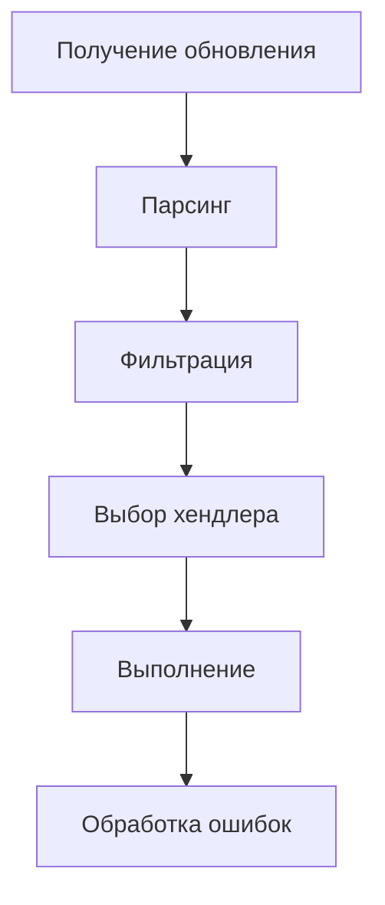

# 🧱 Основы aiogram 3.x

## 📑 Оглавление

1. [Введение](#введение)
2. [Dispatcher - сердце вашего бота](#dispatcher%20-%20сердце%20вашего%20бота)
   - [Что такое Dispatcher?](#что%20такое%20dispatcher)
   - [Основные методы Dispatcher](#основные%20методы%20dispatcher)
   - [Жизненный цикл обновления](#жизненный%20цикл%20обновления)
3. [Bot - интерфейс к Telegram API](#bot%20-%20интерфейс%20к%20telegram%20api)
   - [Что такое Bot?](#что%20такое%20bot)
   - [Основные методы Bot](#основные%20методы%20bot)
   - [Настройка Bot](#настройка%20bot)
4. [Router - организуем код логично](#router%20-%20организуем%20код%20логично)
   - [Что такое Router?](#что%20такое%20router)
   - [Создание и использование Router](#создание%20и%20использование%20router)
   - [Вложенные роутеры](#вложенные%20роутеры)
5. [Асинхронность в aiogram](#асинхронность%20в%20aiogram)
   - [Почему асинхронность важна?](#почему%20асинхронность%20важна)
   - [Основы async/await](#основы%20async/await)
   - [Асинхронность в aiogram](#асинхронность%20в%20aiogram)
6. [Структура проекта](#структура%20проекта)
   - [Почему важна структура?](#почему%20важна%20структура)
   - [Рекомендуемая структура](#рекомендуемая%20структура)
   - [Пример реализации](#пример%20реализации)
7. [Dependency Injection (DI)](#dependency%20injection%20(di))
   - [Что такое DI?](#что%20такое%20di)
   - [DI в aiogram](#di%20в%20aiogram)
   - [Практический пример](#практический%20пример)
8. [Полный пример кода](#полный%20пример%20кода)
9. [Заключение](#заключение)

---

## 📖 Введение

Добро пожаловать в главу, где мы погрузимся в фундаментальные концепции aiogram 3.x! Если в предыдущих главах мы учились создавать простых ботов, то теперь разберем, как устроен фреймворк изнутри. Понимание этих основ — ключ к созданию сложных, масштабируемых и эффективных ботов.

**Что мы изучим:**
- **Dispatcher** — центральный узел, управляющий обработкой всех сообщений
- **Bot** — ваш мост к Telegram API
- **Router** — инструмент для организации кода в больших проектах
- **Асинхронность** — почему aiogram такой быстрый и как это работает
- **Структура проекта** — как правильно организовать код
- **Dependency Injection** — как сделать код гибким и тестируемым

Эта глава особенно важна для тех, кто хочет перейти от простых эхо-ботов к серьезным проектам. Мы будем двигаться от простого к сложному, с множеством примеров и аналогий из реальной жизни.

---

## 🔄 Dispatcher - сердце вашего бота

### Что такое Dispatcher?

Представьте себе **Dispatcher** как центральный вокзал большого города. Каждое сообщение от пользователя — это поезд, прибывающий на вокзал. Диспетчер (Dispatcher) должен:
1. Принять поезд (получить сообщение)
2. Определить, на какой путь его направить (какой хендлер обработает)
3. Отправить поезд по нужному пути (передать сообщение хендлеру)

В технических терминах, **Dispatcher** — это центральный компонент aiogram, который:
- Получает обновления от Telegram API
- Распределяет их по обработчикам (хендлерам) в соответствии с фильтрами
- Управляет жизненным циклом каждого обновления

### Основные методы Dispatcher

Давайте рассмотрим ключевые методы Dispatcher, которые вы будете использовать постоянно:

#### 1. `include_router(router)`
Используется для подключения роутеров к диспетчеру. Роутеры — это как отдельные цеха на заводе, каждый отвечает за свою часть работы.

```python
from aiogram import Router

user_router = Router()
admin_router = Router()

# Подключаем роутеры к диспетчеру
dp.include_router(user_router)
dp.include_router(admin_router)
```

#### 2. `start_polling(bot)`
Запускает процесс получения обновлений через long polling. Это как включить приемник, чтобы ловить радиоволны.

```python
async def main():
    await dp.start_polling(bot)
```

#### 3. `feed_update(update)`
Позволяет вручную передать обновление в диспетчер. Полезно для тестирования или при работе с вебхуками.

```python
# Создаем искусственное обновление
update = types.Update(message=types.Message(...))
await dp.feed_update(update)
```

#### 4. `workflow_data`, `context`, `storage`
Продвинутые методы для управления состоянием и контекстом. Рассмотрим их в следующих главах.

### Жизненный цикл обновления

Давайте проследим путь сообщения от пользователя до хендлера:

1. **Получение обновления**: Telegram отправляет обновление на ваш сервер
2. **Парсинг**: aiogram преобразует JSON в объекты Python
3. **Фильтрация**: Dispatcher проверяет, подходит ли обновление под фильтры хендлеров
4. **Выбор хендлера**: Находит наиболее подходящий хендлер
5. **Выполнение**: Запускает хендлер с переданными параметрами
6. **Обработка ошибок**: Если произошла ошибка, передает ее в обработчик ошибок



---

## 🤖 Bot - интерфейс к Telegram API

### Что такое Bot?

**Bot** — это ваш личный переводчик, который говорит на языке Python и понимает язык Telegram API. Когда вы хотите что-то сделать в Telegram (отправить сообщение, получить информацию о пользователе и т.д.), вы обращаетесь к объекту Bot.

Основные задачи Bot:
- Отправка запросов к Telegram API
- Аутентификация с помощью токена
- Обработка ответов от Telegram
- Управление настройками бота

### Основные методы Bot

Давайте рассмотрим самые часто используемые методы:

#### 1. Отправка сообщений
```python
# Отправка текстового сообщения
await bot.send_message(chat_id=123, text="Привет!")

# Отправка фото
await bot.send_photo(chat_id=123, photo="photo.jpg", caption="Красивое фото")

# Отправка документа
await bot.send_document(chat_id=123, document="document.pdf")
```

#### 2. Получение информации
```python
# Информация о боте
me = await bot.get_me()
print(f"Имя бота: {me.first_name}")

# Информация о чате
chat = await bot.get_chat(chat_id=123)
print(f"Название чата: {chat.title}")

# Информация о пользователе
user = await bot.get_user(user_id=123456)
print(f"Имя пользователя: {user.full_name}")
```

#### 3. Управление чатами
```python
# Создание приглашения
invite_link = await bot.create_chat_invite_link(chat_id=123)

# Установка прав
await bot.set_chat_permissions(chat_id=123, permissions=types.ChatPermissions(can_send_messages=True))

# Кикнуть пользователя
await bot.ban_chat_member(chat_id=123, user_id=456)
```

#### 4. Работа с файлами
```python
# Получение файла
file_info = await bot.get_file(file_id="ABC123")
file_path = file_info.file_path

# Скачать файл
from aiogram import types
file = await types.FSInputFile(file_path)
await bot.send_document(chat_id=123, document=file)
```

### Настройка Bot

При создании Bot можно передать различные параметры:

```python
from aiogram.client.default import DefaultBotProperties
from aiogram.enums import ParseMode

bot = Bot(
    token="YOUR_TOKEN",
    default=DefaultBotProperties(
        parse_mode=ParseMode.HTML,  # Режим форматирования по умолчанию
        link_preview_is_disabled=True,  # Отключить превью ссылок
        protect_content=True  # Защита от пересылки
    )
)
```

**Основные параметры:**
- `parse_mode` - режим форматирования (HTML/Markdown)
- `link_preview_is_disabled` - отключить превью ссылок
- `protect_content` - защитить контент от пересылки
- `disable_notification` - отключить уведомления

---

## 🗺️ Router - организуем код логично

### Что такое Router?

**Router** — это как разделы в большой книге. Вместо того чтобы писать все хендлеры в одном файле, мы разделяем их по логическим блокам:
- Один роутер для пользовательских команд
- Другой для админских функций
- Третий для работы с платежами
- И так далее

Роутеры помогают:
- Организовать код в больших проектах
- Избежать конфликта имен
- Легко добавлять/удалять функциональность
- Упростить тестирование

### Создание и использование Router

#### Шаг 1: Создание роутера
```python
from aiogram import Router, F
from aiogram.filters import Command

user_router = Router()

@user_router.message(Command("start"))
async def cmd_start(message: types.Message):
    await message.answer("Привет, пользователь!")

@user_router.message(F.text == "помощь")
async def cmd_help(message: types.Message):
    await message.answer("Чем могу помочь?")
```

#### Шаг 2: Подключение к диспетчеру
```python
dp = Dispatcher()
dp.include_router(user_router)
```

#### Шаг 3: Вложенные роутеры
Роутеры можно вкладывать друг в друга:

```python
# Главный роутер
main_router = Router()

# Дочерние роутеры
user_router = Router()
admin_router = Router()

# Вкладываем роутеры
main_router.include_router(user_router)
main_router.include_router(admin_router)

# Подключаем главный роутер к диспетчеру
dp.include_router(main_router)
```

### Вложенные роутеры

Вложенные роутеры работают как матрешки — внешний роутер содержит внутренние. Это полезно для:
- Группировки связанных функций
- Применения общих фильтров
- Организации сложных проектов

```python
# Создаем роутеры
main_router = Router()
user_router = Router()
admin_router = Router()

# Добавляем хендлеры в дочерние роутеры
@user_router.message(Command("profile"))
async def user_profile(message: types.Message):
    await message.answer("Ваш профиль")

@admin_router.message(Command("stats"))
async def admin_stats(message: types.Message):
    await message.answer("Статистика бота")

# Вкладываем роутеры
main_router.include_router(user_router)
main_router.include_router(admin_router)

# Можно добавить middleware для всего main_router
@main_router.middleware()
async def main_middleware(handler, event, data):
    print("Обработка через main_router")
    return await handler(event, data)
```

---

## ⚡ Асинхронность в aiogram

### Почему асинхронность важна?

Представьте, что вы официант в ресторане. Если вы подходите к столику, принимаете заказ, относите его на кухню, ждете, пока приготовят, и только потом идете к следующему столику — это **синхронный** подход. Неэффективно, правда?

**Асинхронный** подход: вы принимаете заказ у первого столика, относите на кухню, и пока готовится — идете принимать заказ у второго столика. Так вы обслуживаете больше клиентов за то же время.

В программировании то же самое:
- **Синхронный код**: выполняет одну операцию за раз, блокируя выполнение других
- **Асинхронный код**: может приостанавливать выполнение одной операции и переключаться на другую

### Основы async/await

#### Ключевые концепции:
1. **`async def`** — объявление асинхронной функции
2. **`await`** — ожидание завершения асинхронной операции
3. **Event Loop** — цикл событий, который управляет выполнением асинхронных задач

#### Пример:
```python
import asyncio
import time

# Синхронная функция
def sync_function():
    print("Начало синхронной операции")
    time.sleep(2)  # Блокируем выполнение на 2 секунды
    print("Конец синхронной операции")

# Асинхронная функция
async def async_function():
    print("Начало асинхронной операции")
    await asyncio.sleep(2)  # Неблокирующее ожидание
    print("Конец асинхронной операции")

async def main():
    print("Запуск синхронных операций:")
    start = time.time()
    sync_function()
    sync_function()
    print(f"Затрачено времени: {time.time() - start:.2f} секунд")
    
    print("\nЗапуск асинхронных операций:")
    start = time.time()
    await asyncio.gather(
        async_function(),
        async_function()
    )
    print(f"Затрачено времени: {time.time() - start:.2f} секунд")

asyncio.run(main())
```

**Результат выполнения:**
```
Запуск синхронных операций:
Начало синхронной операции
Конец синхронной операции
Начало синхронной операции
Конец синхронной операции
Затрачено времени: 4.00 секунд

Запуск асинхронных операций:
Начало асинхронной операции
Начало асинхронной операции
Конец асинхронной операции
Конец асинхронной операции
Затрачено времени: 2.00 секунд
```

### Асинхронность в aiogram

Все хендлеры в aiogram должны быть асинхронными:

```python
# Правильно
@dp.message(Command("start"))
async def cmd_start(message: types.Message):
    await message.answer("Привет!")

# Неправильно - вызовет ошибку!
@dp.message(Command("help"))
def cmd_help(message: types.Message):
    message.answer("Помощь")  # Отсутствует await
```

**Почему все должно быть асинхронным?**
1. **Производительность**: бот может обрабатывать тысячи сообщений одновременно
2. **Неблокирующие операции**: ожидание ответа от Telegram не останавливает бота
3. **Интеграция**: легко взаимодействовать с асинхронными библиотеками (базы данных, HTTP-клиенты)

---

## 📁 Структура проекта

### Почему важна структура?

Когда вы создаете простого бота с 10 хендлерами, можно писать все в одном файле. Но когда проект растет до сотен хендлеров, появляется:
- Путаница в коде
- Сложность в поиске нужной функции
- Проблемы с тестированием
- Трудности при командной разработке

Хорошая структура проекта решает эти проблемы!

### Рекомендуемая структура

```
my_bot/
├── venv/                    # Виртуальное окружение
├── bot.py                   # Точка входа
├── config.py                # Конфигурация
├── requirements.txt         # Зависимости
├── handlers/                # Хендлеры
│   ├── __init__.py
│   ├── user_handlers.py     # Хендлеры для пользователей
│   ├── admin_handlers.py    # Хендлеры для админов
│   └── payment_handlers.py  # Хендлеры для платежей
├── keyboards/               # Клавиатуры
│   ├── __init__.py
│   ├── user_keyboards.py    # Клавиатуры для пользователей
│   └── admin_keyboards.py   # Клавиатуры для админов
├── services/                # Бизнес-логика
│   ├── __init__.py
│   ├── user_service.py      # Логика работы с пользователями
│   └── payment_service.py   # Логика платежей
├── utils/                   # Утилиты
│   ├── __init__.py
│   ├── decorators.py        # Декораторы
│   └── helpers.py           # Вспомогательные функции
└── middlewares/             # Мидлвари
    ├── __init__.py
    └── auth_middleware.py   # Мидлварь аутентификации
```

### Пример реализации

#### 1. Точка входа (bot.py)
```python
import asyncio
import logging
from aiogram import Bot, Dispatcher
from config import BOT_TOKEN

# Импортируем роутеры
from handlers.user_handlers import user_router
from handlers.admin_handlers import admin_router
from handlers.payment_handlers import payment_router

# Настройка логирования
logging.basicConfig(level=logging.INFO)

# Инициализация бота и диспетчера
bot = Bot(token=BOT_TOKEN)
dp = Dispatcher()

# Подключаем роутеры
dp.include_router(user_router)
dp.include_router(admin_router)
dp.include_router(payment_router)

async def main():
    await dp.start_polling(bot)

if __name__ == "__main__":
    asyncio.run(main())
```

#### 2. Хендлеры пользователей (handlers/user_handlers.py)
```python
from aiogram import Router, F
from aiogram.filters import Command
from aiogram.types import Message

user_router = Router()

@user_router.message(Command("start"))
async def cmd_start(message: Message):
    await message.answer("Привет! Я твой бот!")

@user_router.message(F.text == "помощь")
async def cmd_help(message: Message):
    await message.answer("Чем могу помочь?")
```

#### 3. Хендлеры админов (handlers/admin_handlers.py)
```python
from aiogram import Router, F
from aiogram.filters import Command, AdminFilter
from aiogram.types import Message

admin_router = Router()

@admin_router.message(Command("stats"), AdminFilter(is_admin=True))
async def cmd_stats(message: Message):
    await message.answer("Статистика бота...")
```

#### 4. Сервисы (services/user_service.py)
```python
class UserService:
    def __init__(self, db_connection):
        self.db = db_connection
    
    async def get_user(self, user_id: int):
        # Логика получения пользователя из БД
        pass
    
    async def create_user(self, user_data):
        # Логика создания пользователя
        pass
```

---

## 🧩 Dependency Injection (DI)

### Что такое DI?

**Dependency Injection (DI)** — это паттерн проектирования, при котором зависимости объекта передаются извне, а не создаются внутри самого объекта.

Простыми словами: вместо того чтобы создавать объекты внутри класса, мы "внедряем" их через конструктор или методы.

**Пример без DI:**
```python
class UserService:
    def __init__(self):
        self.db = DatabaseConnection()  # Жесткая зависимость
    
    def get_user(self, user_id):
        return self.db.query("SELECT * FROM users WHERE id = ?", user_id)
```

**Пример с DI:**
```python
class UserService:
    def __init__(self, db_connection):  # Зависимость передается извне
        self.db = db_connection
    
    def get_user(self, user_id):
        return self.db.query("SELECT * FROM users WHERE id = ?", user_id)
```

**Преимущества DI:**
- Гибкость: легко заменить реализацию зависимости
- Тестируемость: можно подставить mock-объекты при тестировании
- Слабая связанность: классы не зависят от конкретных реализаций

### DI в aiogram

Aiogram 3.x имеет встроенную поддержку DI через контекст диспетчера. Это позволяет передавать зависимости в хендлеры.

#### Основные способы внедрения зависимостей:

1. **Через middleware**
```python
from aiogram import Bot, Dispatcher
from services.user_service import UserService

async def user_service_middleware(handler, event, data):
    # Создаем или получаем сервис
    user_service = UserService(db_connection=data["db"])
    # Добавляем в контекст
    data["user_service"] = user_service
    return await handler(event, data)

# Регистрируем middleware
dp.update.middleware(user_service_middleware)

# Использование в хендлере
@dp.message(Command("profile"))
async def cmd_profile(message: Message, user_service: UserService):
    user = await user_service.get_user(message.from_user.id)
    await message.answer(f"Ваш профиль: {user}")
```

2. **Через контекст диспетчера**
```python
from aiogram import Bot, Dispatcher
from services.user_service import UserService

# Создаем сервис
user_service = UserService(db_connection=db)

# Добавляем в контекст
dp["user_service"] = user_service

# Использование в хендлере
@dp.message(Command("profile"))
async def cmd_profile(message: Message):
    user_service = dp["user_service"]
    user = await user_service.get_user(message.from_user.id)
    await message.answer(f"Ваш профиль: {user}")
```

3. **Через фабрику (рекомендуемый способ)**
```python
from aiogram import Bot, Dispatcher
from aiogram.fsm.context import FSMContext
from aiogram.fsm.storage.memory import MemoryStorage
from services.user_service import UserService

# Настройка хранилища
storage = MemoryStorage()

# Фабрика для создания зависимостей
async def user_service_factory(
    bot: Bot,
    dispatcher: Dispatcher,
    event: types.Update,
    **kwargs
) -> UserService:
    return UserService(db_connection=dispatcher["db"])

# Регистрация фабрики
dp.update.register(user_service_factory, UserService)

# Использование в хендлере
@dp.message(Command("profile"))
async def cmd_profile(message: Message, user_service: UserService):
    user = await user_service.get_user(message.from_user.id)
    await message.answer(f"Ваш профиль: {user}")
```

### Практический пример

Давайте создадим полноценный пример с DI:

#### 1. Сервис (services/user_service.py)
```python
class UserService:
    def __init__(self, db_connection):
        self.db = db_connection
    
    async def get_user(self, user_id: int):
        # Имитация запроса к БД
        return {"id": user_id, "name": "John Doe"}
    
    async def create_user(self, user_data: dict):
        # Имитация создания пользователя
        return {"id": 123, **user_data}
```

#### 2. Мидлварь (middlewares/di_middleware.py)
```python
from services.user_service import UserService

async def di_middleware(handler, event, data):
    # Создаем сервисы
    user_service = UserService(db_connection=data["db"])
    
    # Добавляем в контекст
    data["user_service"] = user_service
    
    return await handler(event, data)
```

#### 3. Хендлер (handlers/user_handlers.py)
```python
from aiogram import Router, F
from aiogram.filters import Command
from aiogram.types import Message

user_router = Router()

@user_router.message(Command("profile"))
async def cmd_profile(message: Message, user_service: UserService):
    user = await user_service.get_user(message.from_user.id)
    await message.answer(f"Ваш профиль: {user}")

@user_router.message(Command("register"))
async def cmd_register(message: Message, user_service: UserService):
    user_data = {
        "name": message.from_user.full_name,
        "username": message.from_user.username
    }
    user = await user_service.create_user(user_data)
    await message.answer(f"Вы зарегистрированы: {user}")
```

#### 4. Точка входа (bot.py)
```python
import asyncio
import logging
from aiogram import Bot, Dispatcher
from middlewares.di_middleware import di_middleware
from handlers.user_handlers import user_router

# Настройка логирования
logging.basicConfig(level=logging.INFO)

# Инициализация бота и диспетчера
bot = Bot(token="YOUR_TOKEN")
dp = Dispatcher()

# Добавляем "базу данных" в контекст
dp["db"] = {}  # В реальном проекте здесь будет соединение с БД

# Регистрируем middleware
dp.update.middleware(di_middleware)

# Подключаем роутеры
dp.include_router(user_router)

async def main():
    await dp.start_polling(bot)

if __name__ == "__main__":
    asyncio.run(main())
```

> 💡 **Для глубокого изучения DI** рекомендуем прочитать файл [06-dip.md](06-dip.md) из нашего курса по SOLID принципам. Там вы найдете подробное объяснение Dependency Inversion Principle и практические примеры.

---

## 📝 Полный пример кода

Давайте соберем все вместе в одном примере:

```python
import asyncio
import logging
from aiogram import Bot, Dispatcher, Router, F, types
from aiogram.filters import Command
from aiogram.fsm.context import FSMContext
from aiogram.fsm.storage.memory import MemoryStorage

# Настройка логирования
logging.basicConfig(level=logging.INFO)

# Инициализация бота и диспетчера
bot = Bot(token="YOUR_TOKEN")
storage = MemoryStorage()
dp = Dispatcher(storage=storage)

# Создаем роутеры
user_router = Router()
admin_router = Router()

# Сервис (в реальном проекте будет в отдельном файле)
class UserService:
    def __init__(self, db):
        self.db = db
    
    async def get_user(self, user_id):
        return self.db.get(user_id, {"id": user_id, "name": "Unknown"})
    
    async def save_user(self, user_id, user_data):
        self.db[user_id] = user_data
        return user_data

# Middleware для DI
async def di_middleware(handler, event, data):
    user_service = UserService(db=data["db"])
    data["user_service"] = user_service
    return await handler(event, data)

# Регистрируем middleware
dp.update.middleware(di_middleware)

# Хендлеры пользователей
@user_router.message(Command("start"))
async def cmd_start(message: types.Message, user_service: UserService):
    user = await user_service.get_user(message.from_user.id)
    await message.answer(f"Привет, {user['name']}!")

@user_router.message(Command("profile"))
async def cmd_profile(message: types.Message, user_service: UserService):
    user = await user_service.get_user(message.from_user.id)
    await message.answer(f"Ваш профиль: {user}")

@user_router.message(Command("setname"))
async def cmd_setname(message: types.Message, user_service: UserService, state: FSMContext):
    await message.answer("Введите ваше новое имя:")
    await state.set_state("waiting_for_name")

@user_router.message(F.text, state="waiting_for_name")
async def process_name(message: types.Message, user_service: UserService, state: FSMContext):
    user_data = {"id": message.from_user.id, "name": message.text}
    await user_service.save_user(message.from_user.id, user_data)
    await message.answer(f"Имя сохранено: {message.text}")
    await state.clear()

# Хендлеры админов
@admin_router.message(Command("stats"))
async def cmd_stats(message: types.Message, user_service: UserService):
    users_count = len(user_service.db)
    await message.answer(f"Всего пользователей: {users_count}")

# Подключаем роутеры
dp.include_router(user_router)
dp.include_router(admin_router)

# Добавляем "базу данных" в контекст
dp["db"] = {}

async def main():
    await dp.start_polling(bot)

if __name__ == "__main__":
    asyncio.run(main())
```

---

## 🎯 Заключение

Мы изучили фундаментальные концепции aiogram 3.x, которые являются основой для создания любых ботов. Давайте подведем итоги:

### Что мы узнали:
1. **Dispatcher** — центральный компонент, управляющий обработкой обновлений
2. **Bot** — интерфейс для взаимодействия с Telegram API
3. **Router** — инструмент для организации кода в больших проектах
4. **Асинхронность** — ключ к производительности ботов
5. **Структура проекта** — как правильно организовать код
6. **Dependency Injection** — как сделать код гибким и тестируемым

### Ключевые принципы:
- **Разделение ответственности**: каждый компонент должен заниматься своим делом
- **Асинхронность**: все операции должны быть неблокирующими
- **Модульность**: код должен быть разделен на логические блоки
- **Тестируемость**: используйте DI для легкого тестирования

### Что дальше?

Теперь, когда вы понимаете основы, вы готовы к более сложным темам:
- **Фильтры и мидлвари** (глава 07-Фильтры-событий и 08-Мидлвари)
- **Конечные автоматы (FSM)** (глава 10-Конечные-автоматы-FSM)
- **Webhook и развертывание** (глава 14-Webhook-и-развертывание)

### Советы для практики:
1. **Создайте проект** с хорошей структурой
2. **Используйте роутеры** для разделения функциональности
3. **Примените DI** для внедрения зависимостей
4. **Пишите асинхронный код** во всех хендлерах
5. **Тестируйте** каждый компонент отдельно

### Полезные ресурсы:
- [Официальная документация aiogram](https://docs.aiogram.dev/)
- [Python asyncio документация](https://docs.python.org/3/library/asyncio.html)
- [Руководство по Dependency Injection](06-dip.md)

---

> 💡 **Важно:** Понимание этих основ — 80% успеха в разработке ботов на aiogram. Не торопитесь переходить к сложным темам, пока не усвоите эти концепции.

> ⚠️ **Напоминание:** Всегда используйте асинхронные функции в хендлерах и правильно организуйте структуру проекта с самого начала.

Теперь вы готовы создавать сложных, масштабируемых и эффективных ботов! Удачи в разработке! 🚀✨